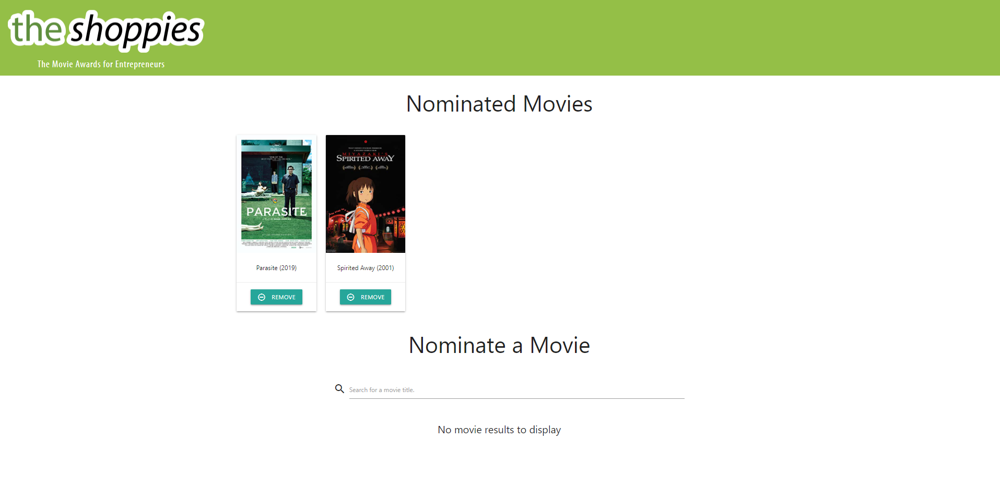

# The Shoppies: The Movie Awards for Entrepreneurs

## Description
This application was built for Shopify's UX Developer Intern & Web Developer Intern Challenge for Fall 2021. It is an application that searches the OMDB API for movies and allows the user to save their favorite films to be nominated for the awards. When they've selected 5 nominees, they should be notified that they've finished.

This is an attempted MERN stack application, utilizing MongoDB, Express, React and Node. It utilizes Materialize CSS, axios, nodemon, and dotenv.

This application is unfinished due to time constraints. [#Challenges](See Challenges).

## Installation
### From your local machine
- Clone the repository and run the dependencies through 'npm install' in both the root and the client folders
- Launch the backend server by cd'ing into the root folder and running 'npm start'
- Launch the frontend by cd'ing into the client folder and running 'npm start'

## Challenges
I ran into several challenges and was unable to complete the technical requirements set forth in the [Google document](https://docs.google.com/document/d/1SdR9rQpocsH5rPTOcxr9noqHRld5NJlylKO9Hf94U8U/edit#heading=h.31w9woubunro).
- I was unable to make POST/GET/DELETE requests due to running into issues with CORS. The backend runs on localhost:4000 whereas the frontend runs on localhost:3000. Calling the db API from the frontend caused me major issues.
- I was unable to successfully pull information from the API nor was I able to write in logic to alert the user of them nominating 5 movies.
- I was unable to successfully deploy the application to Heroku due to the differing localhosts.

## Screenshot of application

